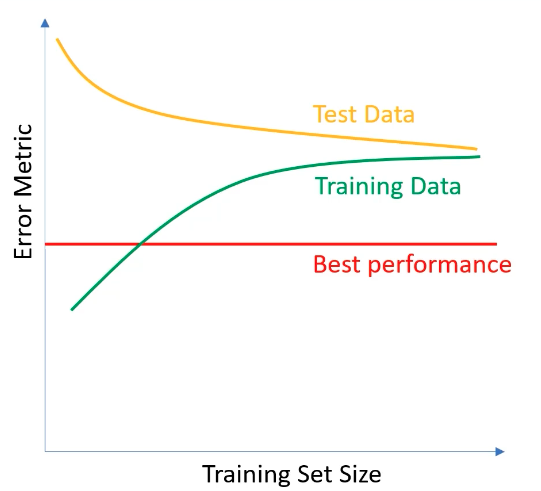
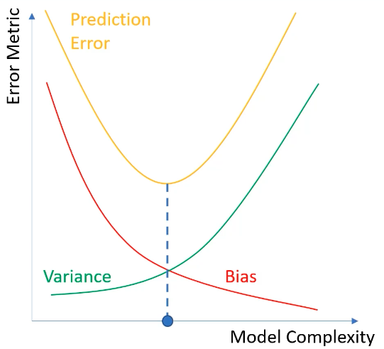

# Pytorch Ultimate 2024 - Bert Gollnick

### 1. Course Setup

### 2. Machine Learning

### 3. Deep Learning Introduction

Layer Types:
- Dense Layer - all perceptrons have a connection between one another
- Convolutional Layer - layers consist of "filters", not all perceptrons connected
- Recurrent Neural Networks - take their own output as an input with delay based on context
- Long Short-Term Memory - uses a 'memory cell' for temporal sequences

Activation Functions:
- ReLU
    - LeakyReLU: x for x => 0, x * a for x < 0, a is usually .01
        - this ensures the gradient is never 0
- tanh - nonlinear, but has a small range (*normalize*), activation btwn -1, 1
- sigmoid - nonlinear, activation btwn 0, 1 -> better for probability
- softmax - probability among n classes, used for multi-class classification

Loss Functions:
- Regression
    - Mean Squared Error
    - Mean Absolute Error - MSE w/ abs instead of square
    - Mean Bias Error - take away the abs sign now
    - Output layer must have 1 node, typically used with linear activation functions
- Binary Classification
    - Binary Cross Entropy
    - Hinge (SVM) Loss
    - Output layer must have 1 node, typically used with sigmoid activation
- Multi-label Classification
    - Multi-label Cross Entropy
    - Output layer has n nodes, typical activation function is softmax

Optimizers:
- Gradient Descent
    - Learning rate: can be too large (misses min) and too small (takes too long)
- Adagrad - adapts learning rate to features, works well for sparse data sets
- Adam - ADAptive Momentum estimation, includes previous gradients in calculation, popular
- Stochastic Gradient Descent, Batch Gradient Descent

Frameworks:
- Tensorflow - most popular, made by google
    - he's making it seem like we're using tensorflow -_-

### 4. Model Evaluation
- High Bias = Low Accuracy, High Variance = Low Precision
    - High Bias means R^2 values of training or validation are off
    - High Variance means the difference between the R^2 values of training and validation is high
- General rule: More **complex models** -> Lower Bias and More Variance
- Low variance algorithms: Linear Regression, LDA, Logistic Regression
- High variance algorithms: Decision Trees, kNN, SVM
-  